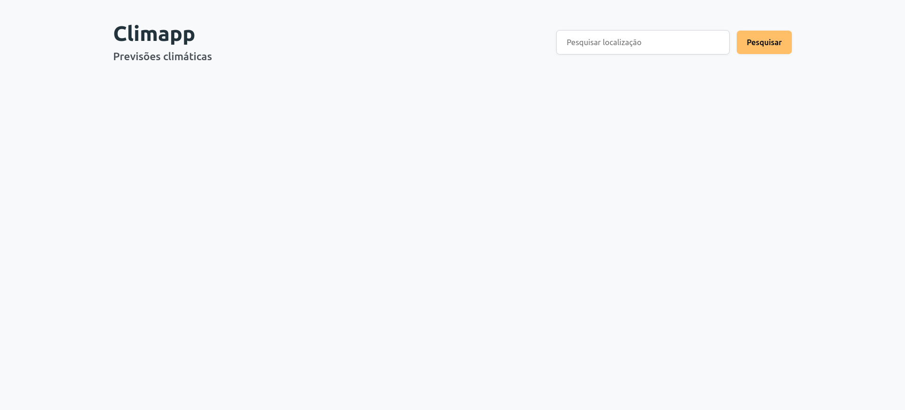

# Climapp

**MATC84 - Laboratório de Programação Web  - Atividade workshop Vue**

### Atividade



### Executando o projeto pelo Vue playground
Acesse [Vue SFC Playground](https://play.vuejs.org) ou [Playcode](https://playcode.io/vue)

Copie o código dentro do arquivo Clima.vue dentro de `src/components/Clima.vue` 

Cole dentro do playground e execute o projeto

Após finalizar a atividade copie o código final dentro do playgound, crie um novo arquivo com a extensão `.vue` e envie para o formulário disponibilizado pela equipe.
### Executando o projeto localmente
#### Instruções de instalação

Tenha o Yarn instalado em sua máquina:

```bash
npm install --global yarn
```

Clone o projeto a partir do Github:

```bash
# Para conexões https:
git clone https://github.com/moniquedsilva/climapp.git

# Para conexões ssh:
git clone git@github.com:moniquedsilva/climapp.git
```

Após finalizar o clone do projeto instale o node_modules e suas dependências:

```bash
yarn install
```

Para rodar o projeto localmente:

```bash
yarn serve
```

Para visualizar abra o seu navegador e digite: `localhost:8080`, a numeração da porta pode mudar a depender da sua rede.